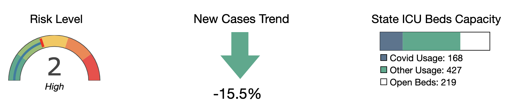

# Covid State and County Daily Numbers

## Description 

I developed this user-friendly app with a basic interface to make it easier to track daily numbers in one's area. Other sites require digging through pages of complex data and graphs, information that the average person doesn't care about. I've learned that to effectively reach people, what you leave is just as important as what you include.

## Table of Contents
* [Run](#Results)
* [Tools](#Tools)
* [Data](#Data)
* [Graphs](#Graphs)
* [Data-Cleaning](#Data-Cleaning)
* [Contact](#Contact)

## Run

The below link takes you to the app, running on Heroku:

[Covid Daily Numbers app](https://covid-county.herokuapp.com/?fbclid=IwAR2fmy3hkjaIgXuhbl1QnknUD2_0nLjfaNe43LTqdZ1HGwLp1rvEMU4ewE4)

## Tools

JavaScript, Plotly.js, D3, Bootstrap, HTML5, CSS, Flask, Python

  

## Data

This app pulls data the following data from the [COVID ACT NOW API](https://apidocs.covidactnow.org/).

<b>New Cases:</b>  New confirmed or suspected cases. 
<b>New Deaths:</b>  New deaths since previous report with erratic values removed by outlier detection. 
<b>Total Cases:</b>  Cumulative confirmed or suspected cases. 
<b>Total Deaths:</b>  Cumulative deaths that are suspected or confirmed to have been caused by COVID-19. 
<b>Fully Vaccinated:</b>  Total number of people completing vaccination - currently those completing their second shot. 
<b>Partially Vaccinated:</b>  Ratio of population that has initiated vaccination. 
<b>Risk Level:</b>  The overall risk level is based on caseDensity, testPositivityRatio, and infectionRate. 
<b>New Cases Trend:</b>  The increase or decrease of newly confirmed cases for state or county as compared to the previous week. 
<b>Icu Bed Capacity:</b>  Information about ICU bed utilization details. 

## Graphs

Shows daily cases and deaths from the start of the pandemic to present. User can zoom in as well as see daily tallies by moving their cursor over the graph.  

Shows the risk level, trend, and ICU capacity for the area presently. (I calculate trend by taking the total confirmed cases of the last seven days and comparing it the previous week.)

Web-Scraper: Jupyter Notebook, Python, BeautifulSoup, Splinter

Database:Pandas

Graphs: Matplotlib

*Risk Level: A state or county’s overall risk level takes into account three metrics: daily new cases per 100K (incidence), infection rate (Rt), and test positivity.
*New Cases Trend: The increase or decrease of newly confirmed cases for state or county as compared to the previous week.
*State ICU Capicty: Staffed intensive care unit (ICU) beds that are currently in use in the State (data at state level only).

## Methodology

The bot uses Chrome Driver to open New York Times and enter a specified search word between the given dates. This brings up anything that contains even a passing references the word 'transgender', so to ensure that the term is important to the article, the bot only pulls those that contain the word (or a related specified word) in the headline or subheader.

The bot pulls the headline, subheader, URL, date, and section for any given article that matches the requirement and stores it in a database.

## Data-Cleaning

Since the sections were quite broad and sometimes ambiguous, I categorized the sections into bins.

<b>Arts:</b>. Movies, Books, Book Review, Theater, Arts, Style, Television, Fashion, First Chapters, Theater Reviews, Art & Design, Dance, Media, Awards Season, Music, International Arts, Art, The Learning Network, DealBook, Fashion & Beauty, Food
            
<b>US New:</b>. U.S., New York, Connecticut, Americas, Education, Education Life, Politics, Elections
            
<b>World News:</b>  World, Africa, Europe, Asia Pacific, Global Opinion, Middle East, Canada, Australia

<b>Sports:</b>  Sports, Olympics, College Basketball, Soccer, Golf, N.B.A., Baseball, Hockey, Tennis

<b>Life:</b>  Home & Garden, Travel, Your Money, Real Estate, Job Market, Smarter Living, Family, Retirement, Self-Care, Parenting, Love, Business
            
<b>Science:</b>  Psychology, Science, Technology, Personal Tech, Mind, Climate, Health, Fertility
            
<b>Misc:</b>  The City, Magazine, Week in Review, Archives, Long Island, Sunday Review, Views, The Upshot, Times Insider, T Magazine, Booming, NYT Now, Giving, Live, The Daily, Today’s Paper, Lesson Plans, Lens, Briefing, Letters, Move, Well, Reader Center, Podcasts, Crosswords & Games, Opinion, Obituaries, Westchester

As the language evolved over time, I further labeled articles with the term used: <b>Transsexual, Transgender, Other</b> (e.g., non-binary, transvestite, etc.)

## Contact

Feel free to contact me with examples or any questions via the information below:

GitHub: [@julia-claira](https://api.github.com/users/julia-claira)

Email: julia-claira@gmail.com
